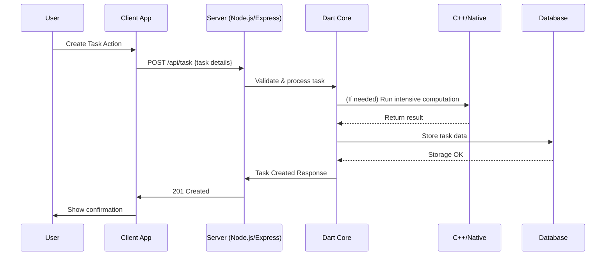

# Task Management App (Node-based)

A cross-platform, multi-language task management application designed to efficiently create, track, and organize tasks. This repository leverages a robust backend with modules in Dart, C++, JavaScript, Swift, and C, enabling high performance, modularity, and platform compatibility.

---

## 🚀 Project Overview

The Task Management App lets users:
- Create, update, delete, and view tasks.
- Organize and prioritize tasks across projects and deadlines.
- Synchronize tasks across multiple platforms (desktop/mobile).
- Benefit from optimized native modules for speed and integration.

---

## 🛠️ Tech Stack

| Language / Tech | Purpose                                                                |
|-----------------|------------------------------------------------------------------------|
| **Dart**        | Core backend logic & business rules; async handling                    |
| **C++**         | Performance-critical modules, algorithms, native integration           |
| **CMake**       | Build automation, C/C++ module compilation                            |
| **JavaScript**  | Node.js server logic, API routes, integration scripts                 |
| **Swift**       | iOS integrations/modules                                              |
| **C**           | Low-level utilities or hardware interfacing                           |
| **Other**       | Miscellaneous: configs, assets, other glue code                       |

Major frameworks/libraries:
- Node.js, Express.js, Dart VM, CMake, (Optional: SQLite/MongoDB, RESTful APIs)

---

## 📁 Repository Structure

```plaintext
.
├── src/
│   ├── dart/         # Dart-related business logic
│   ├── cpp/          # C++ modules & algorithms
│   ├── js/           # JavaScript (Node.js, Express) API server
│   ├── swift/        # Swift (iOS glue code)
│   └── c/            # C code (bindings, utilities)
├── cmake/            # Build scripts for native modules
├── test/             # Unit and integration tests
├── public/           # Static files/assets
├── package.json      # Node.js dependencies
├── CMakeLists.txt    # Top-level CMake config
├── README.md         # Project documentation
└── ...               # Other config files (Dockerfile, .env, etc.)
```

---

## 🏗️ Structured Workflow Diagram

### 1. **Architecture Overview**

mermaid
flowchart TD
    Client[User Interface (Web/Mobile App)]
    API[Node.js API Layer<br/>(JavaScript/Express)]
    Dart[Dart Core Logic]
    CPP[C++ Native Modules]
    Swift[Swift Components<iOS>]
    DB[(Database)]
    
    Client -- HTTP/API Calls --> API
    API -- Orchestration --> Dart
    Dart -- "Perf. Calls" --> CPP
    Dart -- "Platform Calls" --> Swift
    Dart -- CRUD --> DB
    API -- Auth/Simple CRUD --> DB
    CPP -- Data Ops --> DB
    Swift -- Data Ops --> DB
```

- **Client**: Calls REST APIs (task, auth, sync).
- **API Layer (JS/Node)**: Handles request routing and authentication.
- **Dart**: Orchestrates business logic and async flows.
- **C++**: Handles computation-heavy routines or native extensions.
- **Swift**: (If mobile/iOS) custom integrations or notifications.
- **Database**: Persist tasks and user data.

### 2. **Data Flow: Create Task**



---

## 🏁 Getting Started

### Prerequisites

- Node.js (LTS)
- Dart SDK
- CMake, C++ toolchain (for native modules)
- (Optional) Swift tools (for iOS modules)

### Install

```bash
# Clone repository
git clone https://github.com/Gouravlamba/task_management_app_node.git
cd task_management_app_node

# Install Node.js dependencies
npm install

# Build native modules (if applicable)
mkdir -p build && cd build
cmake ..
make

# Dart dependencies (if using Dart modules)
cd ../src/dart
pub get
```

### Run the Server

```bash
npm start
```

---

## 📖 Usage

**API Endpoints**:
- Create Task: `POST /api/task`
- Get Tasks: `GET /api/task`
- Update Task: `PUT /api/task/:id`
- Delete Task: `DELETE /api/task/:id`

Test and interact using Postman, curl, or your frontend integration.

---

## 🤝 Contributing

1. Fork the repo (`https://github.com/Gouravlamba/task_management_app_node`)
2. Create a feature branch (`git checkout -b feat/my-feature`)
3. Commit your changes (`git commit -am 'Add my feature'`)
4. Push and open a Pull Request

---

## 📄 License

Distributed under the MIT License. See [`LICENSE`](LICENSE).

---

## 🙋‍♂️ Contact

- **Owner:** [Gouravlamba](https://github.com/Gouravlamba)
- Issues and PRs are welcome!

---

## 🌐 Acknowledgements

- Node.js, Dart, Express.js, CMake, C++, Swift, Open Source Community
